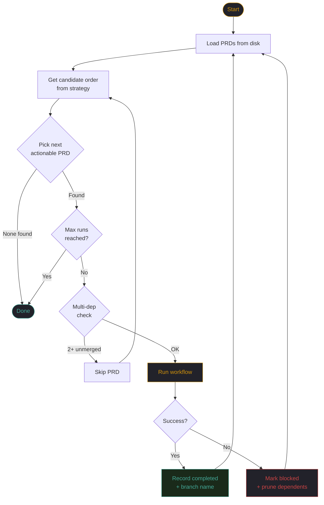

import { Tabs, TabItem, Steps, Aside, Card, CardGrid } from '@astrojs/starlight/components';

When DarkFactory processes multiple PRDs, it performs a sequential walk of the dependency graph. The graph execution engine in `graph_execution.py` determines which PRDs to include, what order to process them, and how to handle failures.

### Execution Loop

The following flowchart shows the core `execute_graph` loop -- how the harness picks, executes, and handles the outcome of each PRD:



Key points: the loop **re-loads PRDs from disk** after every run, enabling mid-run DAG growth (e.g., planning workflows that create child PRDs). On failure, the harness marks the PRD blocked and **prunes all transitive dependents** so they are not attempted.

## Two Strategies

DarkFactory supports two execution strategies, selected based on the command invocation:

<Tabs>
<TabItem label="RootedStrategy">
Used when you target a specific PRD or epic. Computes the graph scope from a root node and walks it in topological order.

```bash frame="terminal" title="Rooted execution"
prd execute PRD-010 --max-runs 5
```

Internally calls `graph_scope()` then `actionable_order()`.
</TabItem>
<TabItem label="QueueStrategy">
Used for drain-ready-queue mode. Discovers all `ready` PRDs across the entire project regardless of parent hierarchy.

```bash frame="terminal" title="Queue execution"
prd execute --queue --max-runs 10
```

Internally calls `discover_ready_queue()`.
</TabItem>
</Tabs>

## `graph_scope()`: What Gets Included

For the `RootedStrategy`, `graph_scope()` computes the set of PRDs that participate in execution. It is the union of three sets:

```
graph_scope(root) = {root}
    ∪ containment_descendants(root)
    ∪ transitive_unmet_deps(all of the above)
```

| Set | Description |
|-----|-------------|
| `{root}` | The target PRD passed to the command |
| `containment_descendants` | All PRDs whose `parent` chain leads back to root |
| `transitive_unmet_deps` | Any PRD in `depends_on` that is not `done`, recursively |

The third set is critical: if PRD-011 (a child of root PRD-010) depends on PRD-005 (an external PRD), PRD-005 is pulled into scope even though it is not a descendant of PRD-010. This ensures the DAG is complete.

## `actionable_order()`: What Runs Next

Given a scope, `actionable_order()` produces a topologically sorted list of PRDs that can run now. A PRD is runnable (`is_runnable`) when:

- Its `kind` is `task`, `spike`, or `bug`, OR it is a leaf node (no children)
- Its status is `ready`
- Every PRD in its `depends_on` list has status `done`

PRDs that are not runnable (e.g., epics with unfinished children, PRDs with unmet deps) are excluded from the actionable list but remain in scope for future iterations.

## `resolve_base_ref()`: Stacked Branches

Each PRD gets its own branch. The base ref for that branch is determined by `resolve_base_ref()`:

| Dependency Count | Base Ref |
|-----------------|----------|
| 0 dependencies | `main` |
| 1 dependency | The dependency's branch (stacked branch) |
| 2+ dependencies | Error -- restructure your dependencies |

Single-dependency stacking means downstream PRDs build on top of upstream changes:

```
main
 └── prd/005-config-validation
      ├── prd/011-retry-logic
      │    └── prd/013-integration-tests
      └── prd/012-timeout-handling
```

<Aside type="caution">
Multi-dependency base resolution is deliberately unsupported. If PRD-013 depends on both PRD-011 and PRD-012, the harness raises an error. Restructure so PRD-013 depends on one of them, and that one depends on the other. Linear chains stack cleanly; diamonds do not.
</Aside>

## Mid-Run DAG Growth

The harness re-loads PRDs from disk between each execution run. This enables a critical pattern: planning workflows that create new child PRDs during execution.

```
Run 1: Execute PRD-010 (planning workflow)
  → Planning agent writes PRD-011, PRD-012, PRD-013 to .darkfactory/prds/
  → Harness re-reads all PRDs from disk

Run 2: Execute PRD-011 (task workflow)
  → Implementation agent writes code
  → Harness re-reads all PRDs from disk

Run 3: Execute PRD-012 (task workflow)
  → ...
```

Without re-loading between runs, child PRDs created by planning workflows would not appear in the graph until the next `prd execute` invocation. Re-loading enables single-invocation epic decomposition and execution.

## Failure Isolation

When a PRD execution fails, the harness isolates the failure:

<Steps>
1. The failed PRD is added to the `blocked_ids` set
2. `_transitive_dependents()` computes all PRDs that directly or transitively depend on the failed PRD
3. Every transitive dependent is added to `blocked_ids` and skipped for the remainder of this run
4. Execution continues with the next PRD that is NOT in `blocked_ids`
</Steps>

```
PRD-011 FAILED
  → PRD-013 SKIPPED (depends on PRD-011)
PRD-012 CONTINUES (independent of PRD-011)
  → PRD-012 DONE
```

Isolation works because each PRD executes in its own git worktree. A failure in one worktree cannot corrupt another.

## ExecutionReport

At the end of a DAG run, the harness returns an `ExecutionReport`:

```python
@dataclass
class ExecutionReport:
    completed: list[str]   # PRD IDs that finished successfully
    failed: list[str]      # PRD IDs that failed during execution
    skipped: list[str]     # PRD IDs skipped due to upstream failure
```

```bash frame="terminal" title="Execution summary"
prd execute PRD-010 --max-runs 5
```

```
Execution complete.
  Completed: PRD-005, PRD-012
  Failed:    PRD-011
  Skipped:   PRD-013

2 of 4 PRDs completed successfully.
```

<Aside type="tip">
After a failed run, fix the root cause in the failing PRD (adjust the PRD spec, or manually fix the code on the branch), then re-execute. Completed PRDs remain `done` and are not re-processed. The harness picks up exactly where it left off.
</Aside>

## The `--max-runs` Flag

Controls how many PRDs the harness will execute in a single invocation. This is useful for:

- **CI resource limits** -- cap execution time by limiting PRD count
- **Incremental review** -- execute a few PRDs, review their PRs, then continue
- **Testing workflow changes** -- run one PRD to verify a workflow modification before processing the full DAG

```bash frame="terminal" title="Limit execution count"
prd execute PRD-010 --max-runs 3
```

After `--max-runs` PRDs have been processed (whether completed, failed, or skipped), the harness stops and reports. The remaining actionable PRDs are left in `ready` status for the next invocation.
