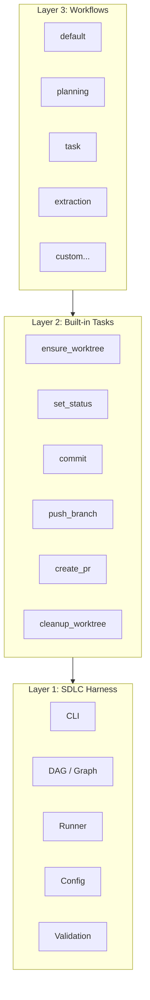

import { Tabs, TabItem, Steps, Aside, Card, CardGrid } from '@astrojs/starlight/components';

DarkFactory is organized into three distinct layers. Each layer has clear responsibilities and strict boundaries. The separation ensures that safety-critical harness code remains stable while workflows and tasks evolve independently.

The governing contract: **workflows never touch git. Builtins never invoke agents. The harness never generates code.**



Each layer depends only on the layer directly below it. Workflows compose built-in tasks. Built-in tasks call into the harness. The harness has no upward dependencies -- it is the stable foundation that enforces all safety invariants.

## Layer 1: The SDLC Harness

The harness is the foundation. It owns every operation that could cause irreversible damage or violate project invariants. Nothing else in the system performs git operations, status transitions, or destructive file modifications.

### Key Modules

| Module | File | Responsibility |
|--------|------|---------------|
| CLI | `cli/` | Command routing, flag parsing, output formatting |
| PRD | `prd.py` | PRD parsing, frontmatter validation, YAML serialization |
| Graph | `graph.py` | Dependency resolution, cycle detection, topological sorting |
| Containment | `containment.py` | Parent-child hierarchy, epic decomposition |
| Config | `config.py` | TOML configuration parsing, defaults, env var overrides |
| Runner | `runner.py` | Task dispatch loop, retry logic, timeout enforcement |
| Graph Execution | `graph_execution.py` | DAG walk strategies, failure isolation, mid-run re-loading |

The harness enforces invariants at every boundary:
- A PRD cannot transition to an invalid status
- A worktree cannot be created from a dirty base
- A PR cannot be opened without passing verification
- A branch cannot be pushed without a commit
- A DAG cannot contain cycles

## Layer 2: Built-in Tasks

Built-in tasks are the atomic operations that workflows compose. They live in the `builtins/` package and are registered by name. The harness dispatches them by looking up the name in the `BUILTINS` registry.

### The 10 Built-ins

| Name | Category | What It Does |
|------|----------|-------------|
| `ensure_worktree` | Git | Creates a git worktree and branch for the PRD |
| `set_status` | Lifecycle | Updates the PRD frontmatter status field |
| `commit` | Git | Stages and commits changes in the worktree |
| `push_branch` | Git | Pushes the worktree branch to the remote |
| `create_pr` | Git | Creates a GitHub PR from the branch |
| `lint_attribution` | Quality | Verifies commit attribution and sign-off |
| `commit_transcript` | Logging | Commits agent transcript to `.darkfactory/transcripts/` |
| `commit_events` | Logging | Commits event log to `.darkfactory/events/` |
| `summarize_agent_run` | Logging | Generates a summary of the agent's actions |
| `cleanup_worktree` | Git | Removes the git worktree after a successful run |

Built-ins are trusted code. They run with full access to harness internals -- git operations, status transitions, file writes. This is intentional: built-ins are the mechanism through which workflows perform privileged operations without having direct access to them.

<Aside type="caution">
Built-ins never invoke agents. If a built-in needs AI reasoning, that work belongs in an AgentTask in the workflow layer. This separation prevents the harness from depending on non-deterministic agent output for safety-critical operations.
</Aside>

## Layer 3: Workflows

Workflows are the user-facing configuration layer. They define how different kinds of PRDs should be implemented by composing built-ins, agent tasks, and shell tasks into an ordered sequence.

### Built-in Workflows

| Name | Purpose |
|------|---------|
| `default` | Standard implementation: worktree, implement, test, commit, PR |
| `planning` | Epic decomposition: analyzes epic PRD, creates child task PRDs |
| `task` | Lightweight task implementation without full verification suite |
| `extraction` | Extracts patterns or data from codebase into structured output |

### Custom Workflows

Custom workflows live in `.darkfactory/workflows/<name>/workflow.py` and export a `workflow` attribute. They override built-ins when their `applies_to` predicate matches and their `priority` is higher.

```python
from darkfactory.workflow import Workflow, AgentTask, ShellTask

workflow = Workflow(
    name="rust-service",
    priority=20,
    applies_to=lambda prd, prds: any(
        i.endswith(".rs") for i in prd.impacts
    ),
    tasks=[...],
)
```

Workflows are intentionally limited in expressiveness. They are data -- a list of Task dataclasses -- not programs. No conditionals, no loops, no imperative logic. Complex orchestration belongs in the harness or in built-in tasks, not in workflow definitions.

## Why Three Layers?

The architecture manages the trust boundary between three concerns:

<CardGrid>
<Card title="Harness (Layer 1)">
Human-authored safety invariants. Deterministic. Trusted. Owns all destructive operations.
</Card>
<Card title="Built-ins (Layer 2)">
Reusable privileged operations. Deterministic. Trusted. Bridge between workflows and the harness.
</Card>
<Card title="Workflows (Layer 3)">
Project-specific configuration. Declarative. Composable. Cannot bypass harness checks.
</Card>
</CardGrid>

An agent executing a workflow task cannot skip validation, cannot perform destructive operations the harness does not support, and cannot modify PRD metadata directly. The agent writes code; the harness decides what to do with it.
