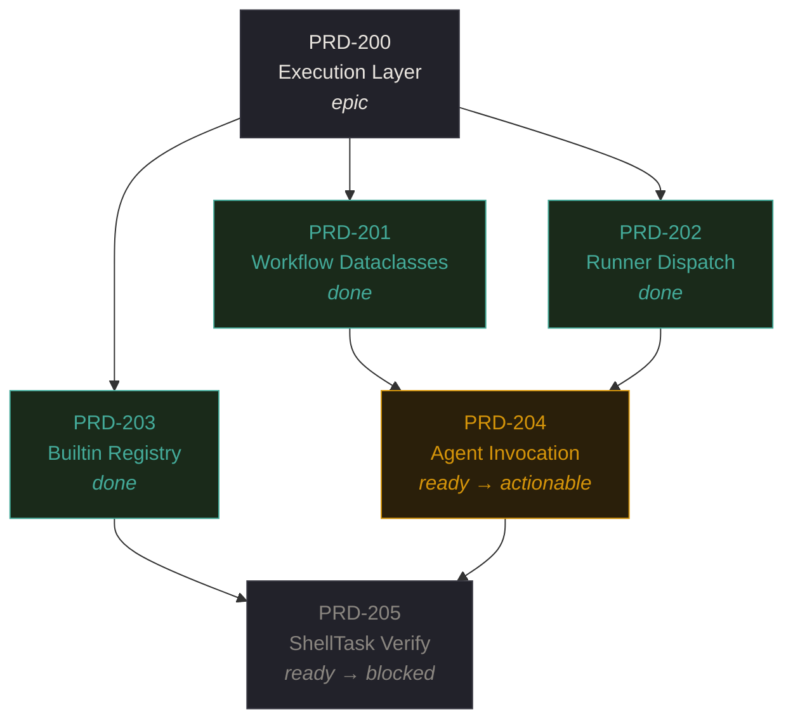
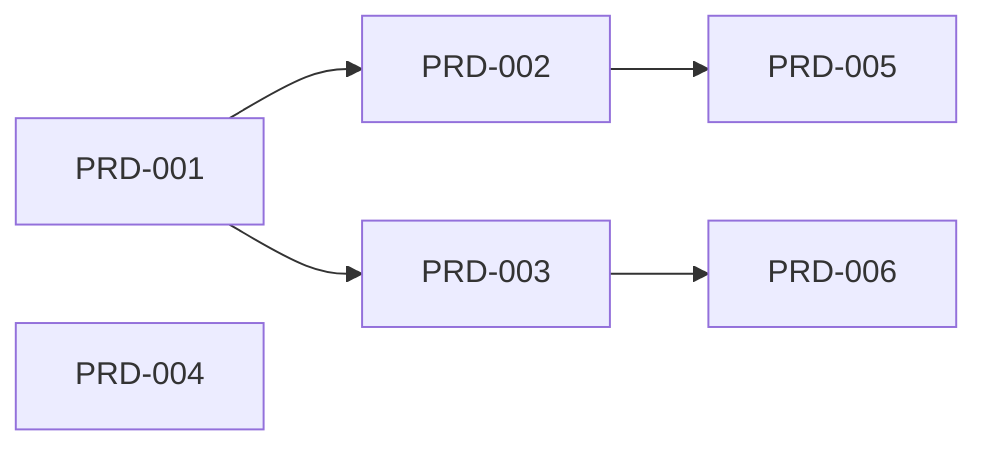

import { Tabs, TabItem, Steps, Aside, Card, CardGrid } from '@astrojs/starlight/components';

DarkFactory constructs a **directed acyclic graph** from `depends_on` fields across all [PRDs](/concepts/prds). The graph type is `dict[str, set[str]]` -- an adjacency list where edges flow from dependency to dependent (downstream direction).

## Visual Overview

The following diagram shows a realistic dependency DAG with status annotations. Arrows flow from dependency to dependent -- a node cannot start until all its upstream dependencies are `done`.



**PRD-204 is actionable** because both of its dependencies (PRD-201 and PRD-202) have status `done`. The scheduler will dispatch it next. **PRD-205 is blocked** even though its own status is `ready` -- PRD-204 has not reached `done` yet, so the `is_actionable()` check fails.

## Graph Construction

`build_graph()` iterates every PRD, reads its `depends_on` list, and inserts edges. Missing dependencies are silently dropped during build -- use `validate` to surface them.

```python
# Internal representation (simplified)
graph: dict[str, set[str]] = {
    "PRD-001": {"PRD-002", "PRD-003"},   # PRD-001 -> PRD-002, PRD-001 -> PRD-003
    "PRD-002": {"PRD-005"},
    "PRD-003": {"PRD-006"},
    "PRD-004": set(),                     # no dependents
    "PRD-005": set(),
    "PRD-006": set(),
}
```

Edge direction convention: an edge from A to B means "A must complete before B can start." Equivalently, B has `depends_on: [A]`.



In this graph, `PRD-001` is a root (no incoming edges). `PRD-005` and `PRD-006` are leaves. `PRD-004` is isolated -- no dependencies and no dependents.

## Core Operations

<Tabs>
  <TabItem label="Cycle Detection">
    `detect_cycles()` uses **Tarjan's SCC algorithm** to find all strongly connected components of size > 1 (plus self-loops). Returns a list of cycles.

    ```python
    cycles = detect_cycles(graph)
    # Returns: [["PRD-010", "PRD-011", "PRD-012"]]
    # Meaning: PRD-010 -> PRD-011 -> PRD-012 -> PRD-010
    ```

    Self-loops count as cycles:

    ```yaml
    # This is invalid:
    id: PRD-050
    depends_on:
      - "[[PRD-050]]"
    ```
  </TabItem>
  <TabItem label="Topological Sort">
    `topological_sort()` uses **Kahn's algorithm** to produce a linear ordering respecting all dependency edges. Tie-breaks by natural sort of PRD IDs for deterministic output.

    ```python
    order = topological_sort(graph)
    # Returns: ["PRD-001", "PRD-004", "PRD-002", "PRD-003", "PRD-005", "PRD-006"]
    ```

    Natural sort means `PRD-4.2` comes before `PRD-4.10` -- each dot-separated component is compared as an integer.
  </TabItem>
  <TabItem label="Transitive Blocks">
    `transitive_blocks()` performs a **BFS** over downstream edges from a given root, returning all transitively reachable nodes.

    ```python
    blocked = transitive_blocks(graph, "PRD-001")
    # Returns: {"PRD-002", "PRD-003", "PRD-005", "PRD-006"}
    ```

    This answers: "If PRD-001 is stuck, what else cannot proceed?"
  </TabItem>
</Tabs>

## Actionability

A PRD is **actionable** when two conditions hold:

1. Its status is `ready`
2. Every PRD in its `depends_on` list exists and has status `done`

```python
def is_actionable(prd, all_prds) -> bool:
    if prd.status != "ready":
        return False
    for dep_id in prd.depends_on:
        dep = all_prds.get(dep_id)
        if dep is None or dep.status != "done":
            return False
    return True
```

The scheduler collects all actionable PRDs to form the execution frontier. These are the PRDs eligible for immediate dispatch.

## Missing Dependencies

`missing_deps()` returns dependency IDs referenced in `depends_on` that do not correspond to any loaded PRD:

```python
missing = missing_deps(all_prds)
# Returns: {"PRD-099": ["PRD-070", "PRD-085"]}
# PRD-070 and PRD-085 both depend on PRD-099, which doesn't exist
```

<Aside type="caution">
Missing deps are silently dropped during graph build. A PRD depending on a nonexistent ID will appear actionable because the missing dep cannot block it. Run `darkfactory validate` to catch these before execution.
</Aside>

## Visualization

A typical DAG with statuses:

```
PRD-001 (done)
  |-- PRD-002 (done)
  |     +-- PRD-005 (ready)      <- actionable
  +-- PRD-003 (in-progress)
        +-- PRD-006 (blocked)    <- waiting on PRD-003
PRD-004 (ready)                  <- actionable (no deps)
```

`PRD-005` and `PRD-004` are both actionable and can execute concurrently in separate [worktrees](/concepts/worktrees). `PRD-006` remains blocked until `PRD-003` reaches `done`.

<Aside type="tip">
The DAG governs execution ordering. For organizational hierarchy (epic/feature/task), see [containment](/concepts/containment). The two structures are orthogonal.
</Aside>
