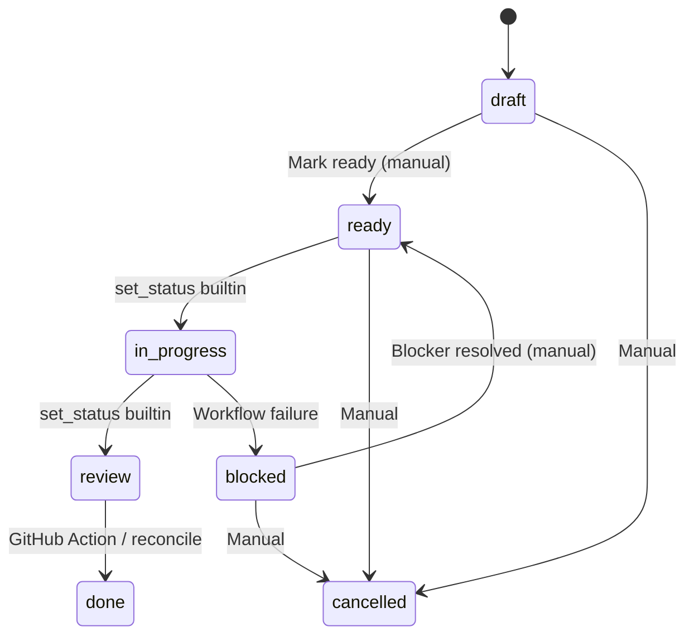

import { Tabs, TabItem, Steps, Aside, Card, CardGrid } from '@astrojs/starlight/components';

Every [PRD](/concepts/prds) has a `status` field. Seven possible values, with transitions controlled by the harness, GitHub Actions, or manual editing.

## States

| Status | Description |
|---|---|
| `draft` | Specification incomplete. Not visible to scheduler. |
| `ready` | Specification complete. Eligible for execution if [dependencies](/concepts/dag) are satisfied. |
| `in-progress` | [Workflow](/concepts/workflows) is actively executing. |
| `review` | Implementation complete. PR open, awaiting merge. |
| `done` | PR merged. Work complete. |
| `blocked` | Cannot proceed. Workflow failure or dependency failure during DAG execution. |
| `cancelled` | Abandoned. Excluded from dependency graph. |

## State Diagram



The happy path flows left to right: **draft** to **ready** to **in-progress** to **review** to **done**. The two recovery paths are **blocked** back to **ready** (when a human resolves the blocker) and **any state** to **cancelled** (manual abandonment).

## Transition Rules

<Tabs>
  <TabItem label="Automatic">
    These transitions are performed by the harness or CI without human intervention:

    **ready -> in-progress**
    Set by `set_status` builtin at workflow start. Occurs when the scheduler dispatches a PRD for execution.

    ```python
    BuiltIn(name="set_status", kwargs={"to": "in-progress"})
    ```

    **in-progress -> review**
    Set by `set_status` builtin after the agent finishes and the PR is opened.

    ```python
    BuiltIn(name="set_status", kwargs={"to": "review"})
    ```

    **review -> done**
    Set by a GitHub Action on PR merge, or by `darkfactory reconcile` which scans for merged PRs and updates statuses.

    ```bash frame="terminal" title="Manual reconciliation"
    darkfactory reconcile
    ```

    **in-progress -> blocked**
    Set automatically when the workflow fails (agent failure after exhausting retries, or a ShellTask with `on_failure="fail"`). Also set when a dependency fails during DAG execution.
  </TabItem>
  <TabItem label="Manual">
    These transitions require a human to edit the PRD frontmatter:

    **draft -> ready**
    The author marks the specification as complete by changing `status: draft` to `status: ready`.

    ```yaml
    # Before
    status: draft

    # After
    status: ready
    ```

    **blocked -> ready**
    When the blocking condition is resolved, a human resets the status to `ready` so the scheduler can pick it up again.

    **Any -> cancelled**
    A human can cancel any PRD at any time. Cancelled PRDs are excluded from the [dependency graph](/concepts/dag). Dependents of a cancelled PRD are not automatically unblocked -- review them manually.
  </TabItem>
</Tabs>

## Transition Summary

| From | To | Trigger |
|---|---|---|
| `draft` | `ready` | Manual: edit frontmatter |
| `ready` | `in-progress` | Automatic: `set_status` builtin at workflow start |
| `in-progress` | `review` | Automatic: `set_status` builtin after implementation |
| `review` | `done` | Automatic: GitHub Action on PR merge, or `darkfactory reconcile` |
| `in-progress` | `blocked` | Automatic: workflow failure or dependency failure during DAG execution |
| `blocked` | `ready` | Manual: when blocker resolved |
| Any | `cancelled` | Manual |

<Aside type="note">
A dependency is satisfied only when the upstream PRD reaches `done`. PRDs in `review` or `in-progress` do not satisfy dependencies. The one exception is [stacked worktrees](/concepts/worktrees), where a PRD with exactly one dep completed in the current run can branch from that dep's branch.
</Aside>

## Status and the DAG

Status interacts with the [dependency DAG](/concepts/dag) through the `is_actionable()` check:

```python
def is_actionable(prd, all_prds) -> bool:
    if prd.status != "ready":
        return False
    for dep_id in prd.depends_on:
        dep = all_prds.get(dep_id)
        if dep is None or dep.status != "done":
            return False
    return True
```

Only `ready` PRDs with all dependencies `done` are dispatched. This means:
- `draft` PRDs are invisible to the scheduler
- `blocked` PRDs must be manually moved back to `ready`
- `cancelled` PRDs are removed from the graph entirely
