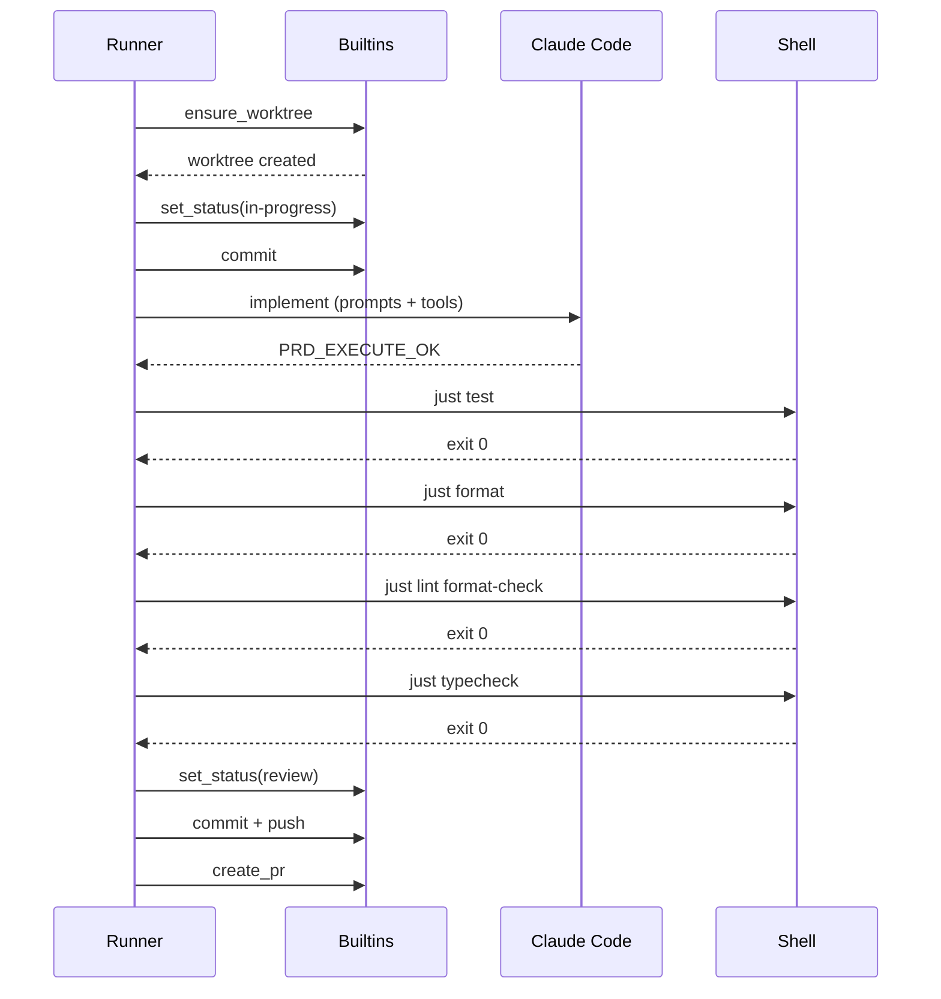

import { Tabs, TabItem, Steps, Aside, Card, CardGrid } from '@astrojs/starlight/components';

A **workflow** is a named sequence of tasks that defines how a [PRD](/concepts/prds) gets implemented. Workflows compose three task types into a pipeline: harness primitives, agent invocations, and shell commands.

## Task Hierarchy

All tasks inherit from the `Task` base class (a marker for `isinstance` dispatch).

<Tabs>
  <TabItem label="BuiltIn">
    References a harness primitive by name. `kwargs` are format-string'd at runtime using [ExecutionContext](#executioncontext) placeholders.

    ```python
    BuiltIn(name="set_status", kwargs={"status": "in-progress"})
    BuiltIn(name="ensure_worktree")
    BuiltIn(name="open_pr", kwargs={"title": "{prd_id}: {prd_title}"})
    BuiltIn(name="cleanup_worktree")
    ```

    Common builtins: `ensure_worktree`, `cleanup_worktree`, `set_status`, `open_pr`, `ensure_branch`.
  </TabItem>
  <TabItem label="AgentTask">
    Invokes an AI coding agent as a subprocess. This is where code gets written.

    ```python
    AgentTask(
        name="implement",
        prompts=["prompts/role.md", "prompts/task.md"],
        tools=[
            "Read", "Edit", "Write", "Glob", "Grep",
            "Bash(cargo:*)", "Bash(pnpm:*)", "Bash(just:*)", "Bash(uv:*)",
            "Bash(git add:*)", "Bash(git status:*)",
            "Bash(git diff:*)", "Bash(git log:*)",
        ],
        model_from_capability=True,
        retries=1,
        verify_prompts=["prompts/verify.md"],
        sentinel_success="PRD_EXECUTE_OK",
        sentinel_failure="PRD_EXECUTE_FAILED",
    )
    ```

    | Parameter | Default | Description |
    |---|---|---|
    | `name` | required | Identifier for this task step |
    | `prompts` | required | List of prompt file paths, composed in order |
    | `tools` | required | Tool allowlist passed to `--allowed-tools` |
    | `model` | `None` | Explicit model override |
    | `model_from_capability` | `True` | Select model from PRD `capability` field. See [agent model](/concepts/agent-model). |
    | `retries` | `1` | Max retry attempts on failure |
    | `verify_prompts` | `[]` | Prompts used during retry, with `{CHECK_OUTPUT}` bound to failure output |
    | `sentinel_success` | `"PRD_EXECUTE_OK"` | String agent must emit to signal success |
    | `sentinel_failure` | `"PRD_EXECUTE_FAILED"` | String agent emits to signal failure |
  </TabItem>
  <TabItem label="ShellTask">
    Runs an arbitrary shell command in the PRD's [worktree](/concepts/worktrees).

    ```python
    ShellTask("test", cmd="just test", on_failure="retry_agent")
    ShellTask("format", cmd="just format", on_failure="fail")
    ShellTask("lint", cmd="just lint format-check", on_failure="retry_agent")
    ShellTask("typecheck", cmd="just typecheck", on_failure="retry_agent")
    ```

    | Parameter | Description |
    |---|---|
    | `name` | Identifier for this task step |
    | `cmd` | Shell command to execute |
    | `on_failure` | `"fail"` (halt workflow), `"retry_agent"` (re-invoke last AgentTask), or `"ignore"` |
    | `env` | Optional environment variable overrides |

    When `on_failure="retry_agent"`, the runner re-invokes the most recent AgentTask with `verify_prompts` and the shell failure output bound to `{CHECK_OUTPUT}`.
  </TabItem>
</Tabs>

## The Default Workflow

The default workflow uses `PRD_IMPLEMENTATION_TEMPLATE.compose()` which wraps the middle tasks with standard builtins (worktree setup, status transitions, PR creation, cleanup):

```python
workflow = PRD_IMPLEMENTATION_TEMPLATE.compose(
    name="default",
    middle=[
        AgentTask(
            name="implement",
            prompts=["prompts/role.md", "prompts/task.md"],
            tools=[
                "Read", "Edit", "Write", "Glob", "Grep",
                "Bash(cargo:*)", "Bash(pnpm:*)", "Bash(just:*)", "Bash(uv:*)",
                "Bash(git add:*)", "Bash(git status:*)",
                "Bash(git diff:*)", "Bash(git log:*)",
            ],
            model_from_capability=True,
            retries=1,
            verify_prompts=["prompts/verify.md"],
        ),
        ShellTask("test", cmd="just test", on_failure="retry_agent"),
        ShellTask("format", cmd="just format", on_failure="fail"),
        ShellTask("lint", cmd="just lint format-check", on_failure="retry_agent"),
        ShellTask("typecheck", cmd="just typecheck", on_failure="retry_agent"),
    ],
)
```

The following sequence diagram shows the full runtime interaction between the runner, builtins, agent, and shell during a default workflow execution:



Notice that all git and lifecycle operations (left side) go through builtins, while verification (right side) runs as shell tasks. The agent only participates in the `implement` step -- it never touches git directly.

The template prepends and appends builtins, producing this effective sequence:

<Steps>
1. `BuiltIn("ensure_worktree")` -- create isolated [worktree](/concepts/worktrees) and branch
2. `BuiltIn("set_status", status="in-progress")` -- transition [status](/concepts/status-lifecycle)
3. `AgentTask("implement")` -- agent writes code
4. `ShellTask("test")` -- run test suite; retry agent on failure
5. `ShellTask("format")` -- run formatter; halt on failure
6. `ShellTask("lint")` -- run linter; retry agent on failure
7. `ShellTask("typecheck")` -- run type checker; retry agent on failure
8. `BuiltIn("set_status", status="review")` -- transition status
9. `BuiltIn("open_pr")` -- create pull request
10. `BuiltIn("cleanup_worktree")` -- remove worktree
</Steps>

## Workflow Object

```python
Workflow(
    name="default",
    description="Standard implementation workflow",
    applies_to=["task", "component"],   # PRD kinds this workflow handles
    priority=0,                          # lower = higher priority when multiple match
    tasks=[...],                         # ordered list of Task objects
    workflow_dir=Path(".darkfactory/workflows/default/"),
    template_name="implement",
)
```

A PRD can override automatic workflow selection by setting `workflow: custom-name` in frontmatter.

## ExecutionContext

The `ExecutionContext` carries threading state through the workflow pipeline. All `BuiltIn` kwargs and prompt files can reference its fields via format strings.

| Placeholder | Type | Description |
|---|---|---|
| `{prd_id}` | `str` | The PRD's ID (e.g., `PRD-070`) |
| `{prd_title}` | `str` | The PRD's title |
| `{prd_slug}` | `str` | The PRD's slug (e.g., `retry-webhook`) |
| `{branch}` | `str` | Branch name (e.g., `prd/PRD-070-retry-webhook`) |
| `{base_ref}` | `str` | Base branch for the PR (usually `main`) |
| `{worktree}` | `Path` | Absolute path to the worktree directory |

Additional context fields (not format-string accessible):

| Field | Type | Description |
|---|---|---|
| `repo_root` | `Path` | Root of the main repository |
| `workflow` | `Workflow` | The executing workflow object |
| `agent_output` | `str` | Captured stdout from last agent invocation |
| `agent_success` | `bool` | Whether the last agent emitted the success sentinel |
| `pr_url` | `str` | URL of the opened PR |
| `model` | `str` | Resolved model name |
| `invoke_count` | `int` | Number of agent invocations so far |
| `dry_run` | `bool` | Whether this is a dry-run execution |
